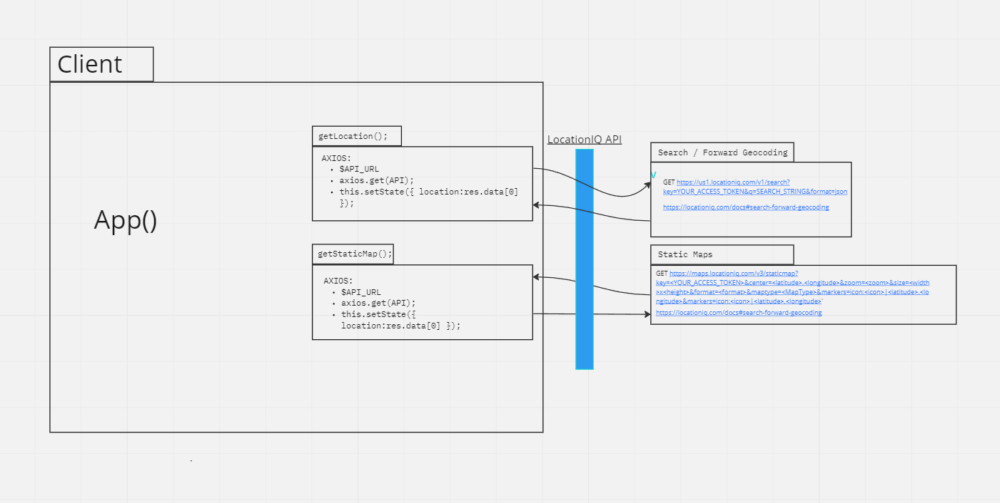

# City Explorer

**Author**:  Aaron Imbrock

**Version**: 1.0.0

## DEMO

DEMO: [CHECK IT OUT!](https://city-explorer-07118c.netlify.app/)

## Overview
<!-- Provide a high level overview of what this application is and why you are building it, beyond the fact that it's an assignment for this class. (i.e. What's your problem domain?) -->

## Getting Started

- Clone Repo:      `git clone git@github.com:aaron-imbrock/city-explorer.git`
- From local repo: `npm install`
- Local Dev:       `npm start`

## Architecture

    Name of feature:                        Set up your React repository & API keys.
    Estimate of time needed to complete:    3 hours
    Start time:                             6PM
    Finish time:                            2AM
    Actual time needed to complete:         4 hours

    Name of feature:                        Set up your React repository & API keys.
    Estimate of time needed to complete:    3 hours
    Start time:                             6PM
    Finish time:                            2AM
    Actual time needed to complete:         4 hours

### locationiq API

## Change Log
<!-- Use this area to document the iterative changes made to your application as each feature is successfully implemented. Use time stamps. Here's an example:

01-01-2001 4:59pm - Application now has a fully-functional express server, with a GET route for the location resource. -->

## Credit and Collaborations
<!-- Give credit (and a link) to other people or resources that helped you build this application. -->
A React application that uses the Axios library to make user-initiated requests for data from third-party APIs.

